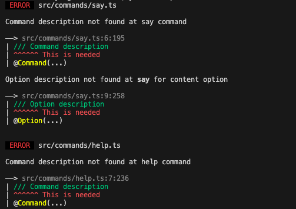

# The Yangon Framework

Yangon is a Discord App framework focused on minmal templating by utilizing TypeScript decorators. Due to decorators being experimental, Yangon only works with TypeScript. If you are looking for a JavaScript based framework, [commandkit](https://commandkit.js.org) and [sapphire](https://sapphirejs.dev) are other well-maintained libraries.

# Bootstraping

First, let us install yangon. Yangon many packages to assist in bot development and some of them are `@yangon-framework/core`, `@yangon-framework/syringe` and `@yangon-framework/shwedagon`

While Yangon can work with `@yangon-framework/core`, we recommend installing `@yangon-framework/shwedagon` which has its own compiler to assist in bot development even further. We will explore this in further sections!

```bash
$ npm install @yangon-framework/core @yangon-framework/shwedagon
```

## Before we begin ...

Yagon heavily depends on `experimentalDecorators` and `emitDecoratorMetadata` being set to true in the tsconfig.

## Basic Bot

Let's start with a bot that repeats what the user says. In our index.ts file, we will add the following code

```ts
import { Client } from "eris"
import path from "path"
import { Yangon } from "@yangon-framework/core"

const client = new Client(`Bot ${process.env.BOT_TOKEN}`, {
    intents: ['guilds']
})

new Yangon(client, {
    commands: path.join(__dirname, "commands")
})

client.connect()
```

Let's code our command. The follow file is `command/say.ts`

```ts
import { CommandInteraction } from "eris"
import { Command, Option, StringOption } from "@yangon-framework/core"

// EXPORTING AS DEFAULT IS VERY IMPORTANT
export default class SayCommand {
    @Command("Repeat something from the bot")
    say(
        ctx: CommandInteraction,
        @Option("What content to repeat", true /* whether the option is required or not */)
        content: StringOption
    ) {
        ctx.createMessage(content.value)
    }
}
```

That's it. Your bot is completed.

# Superpowers

While the above code allows for basic command creation, it gets clumbersome when you have a huge bot with many options. In these cases, we need to describe our commands with our code and without external definition.

This is where `@yangon-framework/shwedagon` comes in. It is a TypeScript builder that allows you to have more freedom on how you write your code. Let's go back to our say command again.

```ts
import { CommandInteraction } from "eris"
import { StringOption } from "@yangon-framework/core"
import { Option, Command } from "@yangon-framework/shwedagon"

// EXPORTING AS DEFAULT IS VERY IMPORTANT
export default class SayCommand {
    /// Repeat something from the bot
    @Command()
    say(
        ctx: CommandInteraction,
        /// What content to repeat
        @Option()
        content: StringOption
    ) {
        ctx.createMessage(content.value)
    }
}
```

We see a couple of changes. Namely, our decorators require less options and are instead exported from the alternate module. We have integrated the decorators with our code using comments! This serves two purposes of describing your code **and** having it automatically registered to the Discord API.

Now, all we have to do is to change our build script from `tsc` to `yangon`. Yangon also respects your tsconfig so there is no need to worry about your code misbehaving

## FAQ

What if we do not set a comment? Our code might crash without a good debugging experience.

> You do not need to worry about this. `yangon` also debugs your code before compiling and if you did not comment your code, it will error.
> 